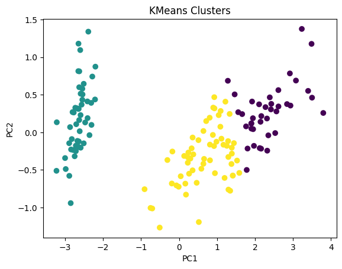
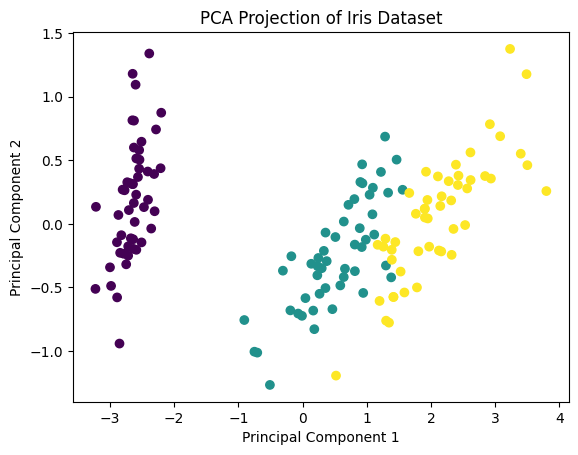
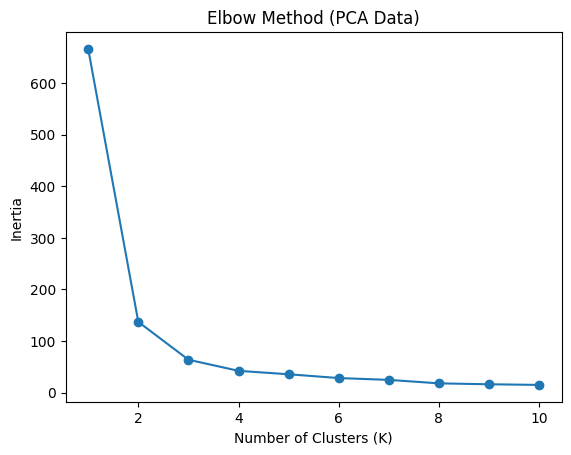

#  Iris Dataset Clustering using K-Means

##  Project Overview

This project explores unsupervised learning using the K-Means clustering algorithm on the Iris dataset.

The primary goal of this project was to understand the complete workflow of clustering, including:

- How K-Means forms clusters
- The role of centroid initialization
- Understanding inertia
- Evaluating clustering quality using Silhouette Score
- Analyzing the effect of PCA on clustering performance

The implementation was intentionally done step-by-step to build strong conceptual understanding of K-Means rather than using high-level abstractions.

---

## 📊 Dataset

This project uses the built-in Iris dataset provided by Scikit-learn.

### Dataset Characteristics

- 150 samples
- 4 numerical features:
  - Sepal Length
  - Sepal Width
  - Petal Length
  - Petal Width
- 3 species (used only for reference; clustering itself is unsupervised)

### Dataset Loading

```python
from sklearn.datasets import load_iris
```

## 📊 Visual Results

### 🔹 K-Means Cluster Visualization



---

### 🔹 PCA Visualization



---

### 🔹 Elbow Method


